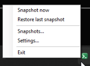

# Terminal Session Keeper

Saves your open Windows Terminal tabs — including the live agent conversations
inside them — and puts them back after a restart.

Windows Update does not care that you had twelve tabs open, each in a different
project with a different agent session. This does.

It is a tray app. There is no window, no shell profile to edit, nothing to add to
your dotfiles, and no scheduled task.

## Features

- **Snapshots your tabs** — directory, title, colour and the agent session running in each one, automatically every 10 minutes.
- **Restores after a reboot** — each tab comes back in its own directory with its resume command waiting at the prompt.
- **Knows four agents** — Claude Code, Codex, Antigravity and Junie, on the Windows side of a tab or inside WSL.
- **Nothing starts on its own** — press Enter in the tabs you actually want, or switch on automatic resume if you disagree.
- **Keeps titles and colours**, including hand-renamed tabs, matched back by content rather than by position. A restored colour is applied the way the colour picker applies one, so the terminal's own **Reset** still clears it.
- **Browse every snapshot** — see what is in it and preview exactly what a restore would launch.

## Requirements

Windows Terminal 1.18 or newer. WSL tabs additionally need `python3` inside the
distro — that is all, and only to read the WSL side. Windows tabs work without WSL
at all.

## Install

Download **[TerminalSessionKeeper.exe](https://github.com/alexlvcom/TerminalSessionKeeper/releases/latest/download/TerminalSessionKeeper.exe)**
and double-click it. It is a single self-contained executable — no .NET runtime
needed, no installer. It runs without administrator privileges and never asks for
elevation.

Open **Settings…** from its tray menu, tick **Start with Windows**, and you are
done.

The exe is unsigned, so Windows may show a SmartScreen warning on first run. See
[Install and first run](docs/GUIDE.md#install-and-first-run) for what that means
and how to verify the download.

## Documentation

- **[User guide](docs/GUIDE.md)** — the tray menu, every setting, how sessions and titles are found, and what to check when something looks wrong.
- **[Development](docs/DEVELOPMENT.md)** — building from source and the versioning conventions.
