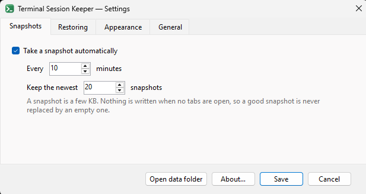

# Terminal Session Keeper — user guide

- [Install and first run](#install-and-first-run)
- [Supported agents](#supported-agents)
- [The tray menu](#the-tray-menu)
- [Settings](#settings)
- [What a restored tab looks like](#what-a-restored-tab-looks-like)
- [Titles and colours](#titles-and-colours)
- [How it finds your sessions](#how-it-finds-your-sessions)
- [Restoring after a reboot](#restoring-after-a-reboot)
- [Where your data lives](#where-your-data-lives)
- [If something looks wrong](#if-something-looks-wrong)

## Install and first run

Download **[TerminalSessionKeeper.exe](https://github.com/alexlvcom/TerminalSessionKeeper/releases/latest/download/TerminalSessionKeeper.exe)**
from the [releases page](https://github.com/alexlvcom/TerminalSessionKeeper/releases/latest).
It is a single self-contained executable — no .NET runtime install needed. It runs
without administrator privileges and never asks for elevation.

Open **Settings…** from its tray menu, tick **Start with Windows**, and you are done.

### Windows SmartScreen

The exe is **unsigned** (there is no code-signing certificate for a free hobby
tool), so Windows may show **"Windows protected your PC."** This is *not* a virus
warning — it only means the file is new and has not built up download reputation
yet. Click **More info → Run anyway**.

Prefer to be sure? The source is right here — see [Development](DEVELOPMENT.md)
and build it yourself.

### Verifying the download

Each release lists the SHA-256 of the exe:

```powershell
Get-FileHash .\TerminalSessionKeeper.exe -Algorithm SHA256
```

Compare it against the hash on that version's
[release page](https://github.com/alexlvcom/TerminalSessionKeeper/releases/latest).

### Requirements

Windows Terminal 1.18 or newer. WSL tabs additionally need `python3` inside the
distro — that is all, and it is only needed to read the WSL side; Windows tabs work
without WSL at all.

## Supported agents

| Agent | Resumed with |
|---|---|
| Claude Code | `claude --resume <id>` |
| Codex | `codex resume <id>` |
| Antigravity | `agy --conversation <id>` |
| Junie | `junie --resume --session-id=<id>` |

All four work whether the agent is running on the Windows side of a tab or inside
WSL. A tab running something else — or nothing — still comes back in its own
directory; it just has no command waiting at the prompt.

## The tray menu

Four things and an exit. Everything else lives in one of the two windows.

| | |
|---|---|
| **Snapshot now** | Save the tabs that are open right now |
| **Restore last snapshot** | Put them back, in a new window |
| **Snapshots…** | Every saved snapshot, what is in it, and restore or preview any of them |
| **Settings…** | Everything below |
| **Exit** | |

## Settings



| | |
|---|---|
| **Take a snapshot automatically** | And how often — 10 minutes by default, 1 minute to 24 hours |
| **Keep the newest N snapshots** | 20 by default; they are a few KB each |
| **Put the tabs back automatically after a reboot** | Guarded — see [Restoring after a reboot](#restoring-after-a-reboot) |
| **Run each resume command** | Off by default — see [What a restored tab looks like](#what-a-restored-tab-looks-like) |
| **Keep saved tab titles** | Freeze restored titles instead of letting the shell rename them |
| **Remember tab colours** | See [Titles and colours](#titles-and-colours) |
| **Put tab colours back** | Applied the way the colour picker applies one, so Reset still clears it |
| **Show a notification** | After a snapshot or a restore |
| **Start with Windows** | `HKCU\...\CurrentVersion\Run`. No elevation, no scheduled task |

## What a restored tab looks like

A restore always builds a **new window** and puts the tabs in it. The name under
**Rebuild tabs into a new window named** is the prefix, and the time the restore ran
is added to it — `wt -w <name>` joins a window that already has that name, so a fixed
one made every later restore append its tabs to the window the first one built.

Each tab comes back in its own directory with its resume command **waiting at the
prompt**:

```
[11:04] ~/source/my-mcp (master●) $ claude --resume 043c02a0-a42b-4441-84d2-754721971e63
```

Press Enter in the tabs you actually want. Nothing starts on its own — twelve
agents and their MCP servers booting at once, right after a reboot, is not what you
want. **Run resume commands automatically** starts them all, if you disagree.

The command is typed into the tab's console input queue, so the prompt receives it
exactly as if you had typed it. That works the same for a PowerShell tab — where
PSReadLine cannot be pre-filled through its own API from outside its prompt — and
for a WSL tab, where the keystrokes cross the ConPTY into the Linux pty and land on
the zsh command line. This is why there is no shell-side hook to install.

A WSL tab also gets one short `cd` typed and run first. That is deliberate: a
`.zshrc` that restores your last working directory runs *after* `wsl --cd` has
applied, and without it every restored tab lands in the same folder.

## Titles and colours

Titles come back as they were, set through the tab's console rather than through
the shell. Going through the shell never survived — a title command has to be
submitted, and the prompt that follows is exactly when a themed shell renames the
tab after its folder again.

A restored tab keeps its saved title until something changes it: resuming the
session, or running any other command. That is normal shell behaviour and it is why
agent tabs end up correctly named again on their own. **Keep saved tab titles**
freezes them for good instead, at the cost of the shell and the agents never
updating them again.

**Colours are kept too.** No Windows Terminal API exposes a tab colour and nothing
persists one, so the window is asked to render itself and the colour is read from
the tab's own pixels. That works while the terminal is behind other windows — as it
usually is when the snapshot timer fires — because the window draws itself rather
than being grabbed off the screen.

A colour has to be read the same way **twice in a row** before it is recorded, and a
reading close to the colour already on file leaves that colour alone. Both rules
exist because the sampler reads its own output: a restored colour is sampled again on
the next snapshot, and un-blending multiplies a rounding error by more than three, so
without them a tab drifts a little further every cycle until it saturates — which is
how a crimson tab once walked to `#FF0051` and a plain one picked up a grey it never
had. The cost is that a colour you set by hand takes one extra snapshot to stick, and
a colour you clear takes one extra snapshot to disappear.

A *minimized* window has nothing to draw, and its colours carry forward instead. So
does a window whose tab positions cannot be trusted to line up with its pixels — on a
monitor scaled differently from this process, if per-monitor DPI awareness is ever
unavailable — since reading it would put one tab's colour on its neighbour.
Anything uncertain — a frame the two background readings disagree about, a tab
scrolled out of an overflowing strip — is recorded as no colour rather than as a
guess. Turn the whole thing off with **Remember tab colours** if you would rather it
never looked.

**Putting a colour back** is not `wt --tabColor`, deliberately. Windows Terminal keeps
two colours per tab: the one the command line sets, and the one the right-click colour
picker sets on top of it. The picker's **Reset** clears only the second — so a tab
coloured from the command line snaps back to that colour every time you try to clear
it, and nothing short of closing the tab is rid of it.

So a restored colour is applied the way the picker applies one, with Windows Terminal's
`setTabColor` action. Actions can only be reached by a key, so the restore adds one to
`settings.json`, bound to F13 upwards — keys no keyboard can produce, so nothing you
press can collide with one — focuses each tab, presses it, and takes the action back
out. Your file is left as it was, and the entries are removed by id, so an edit
Windows Terminal or you made in between is never clobbered. If the app is killed
mid-restore, the next start removes them.

Nothing is pressed on trust: each keystroke waits for UI Automation to confirm that the
intended tab is selected in the window the restore built. If the window cannot be
brought to the front — Windows refuses that while you are busy in another application —
the colour is skipped and the log says so. Turn it off with **Put tab colours back** and
restored tabs come back uncoloured, with Windows Terminal's settings never touched.

### Pinning a title or colour by hand

Put it in `%LocalAppData%\TerminalSessionKeeper\overrides.json` — an entry here
always wins:

```json
[
  {
    "cwd": "/home/you/source/my-api",
    "title": "ABC-1022",
    "tabColor": "#7B3FF2"
  }
]
```

`cwd` must match the snapshot exactly. Use this for any title the matcher could not
work out — the **Snapshots** window lists those at the bottom. A title set here is
pinned: neither the matcher nor the shell overwrites it.

Snapshots are plain JSON and meant to be edited; fixing a wrong title is a one-line
change.

## How it finds your sessions

Tabs are identified by `WT_SESSION`, the id Windows Terminal puts in every pane's
environment. That links a WSL shell to its Windows tab exactly. Process start times
cannot stand in for it: WSL's clock drifts from the host's across hibernate, by 15
hours and more in practice, and not by a constant offset.

Session ids come from the running processes themselves — the open
`/tmp/claude-*/<project>/<session>/` handle for Claude inside WSL, the codex SQLite
state for Codex — so two tabs in the same folder still get their own conversation.

Titles are matched to tabs by content, not by position: dragging a tab changes where
it sits but not what it is. In order: the shell's own untouched title, then the
agent's session title, then the **git branch** — which is how a hand-renamed tab
like `ABC-1022` finds its way back to `my-api`, whose branch is
`ABC-1022-JWT-Alongside-Session-Auth` — then the folder name. Every tab has exactly
one title, so if one tab and one title are left over at the end, that pairing is
forced and gets made. More than one left over is reported rather than guessed at.

## Restoring after a reboot

**Restore after reboot** only fires when it is safe to: the first run after a reboot
*and* no Windows Terminal window currently has tabs. Restoring next to a window that
is still open puts **both** into the next snapshot, and the restore after that would
rebuild twenty tabs instead of ten. Each snapshot records the machine's boot time so
the app can tell "the session these tabs belonged to is gone" from "the user is
still sitting in it".

Restoring by hand while a window is open is allowed — it asks first, says exactly
what will happen, and the rebuilt tabs go into a window of their own rather than
joining the one already on screen.

## Where your data lives

Everything lives in `%LocalAppData%\TerminalSessionKeeper`:

| Path | Contents |
|---|---|
| `Snapshots\` | The saved tab sets, plain JSON |
| `settings.json` | Your settings |
| `overrides.json` | Hand-pinned titles and colours |
| `tab-colors.json` | What the colour sampler has read per tab, and what it has confirmed |
| `Logs\terminalsessionkeeper.log` | Rotating log |

Uninstalling is deleting the exe and that folder.

## If something looks wrong

| Symptom | Cause |
|---|---|
| No WSL tabs in the snapshot | `python3` is missing from the distro. Windows tabs are unaffected |
| A tab has no resume command | No live session was found; the **Snapshots** window says which agent and which folder |
| A restored tab has no command at its prompt | Its shell took longer than expected to start. The log names the tab |
| Some titles are missing | UI Automation could not reach the window. Titles from an earlier snapshot of the same tab are reused |
| A title could not be attributed | Listed under "could not be attributed" — pin it in `overrides.json` |
| Tab colours are missing | The window was minimized when the snapshot ran, or the colour has only been read once so far. They come back on the next snapshot taken with the window open, or pin them in `overrides.json` |
| A restored tab came back uncoloured | The rebuilt window could not be brought to the front to press the colour key at — it happens when you are working in another application during a manual restore. The log names the tab |
| A tab colour is wrong | Clear it in the terminal (right-click → Color… → **Reset**); two snapshots later the app forgets it too. A colour pinned in `overrides.json` has to be removed there |

The **Snapshots** window prints exactly what was captured, and **Preview restore**
prints exactly what would be launched. Between those two, most problems are visible
without digging. `Logs\terminalsessionkeeper.log` has the rest.
